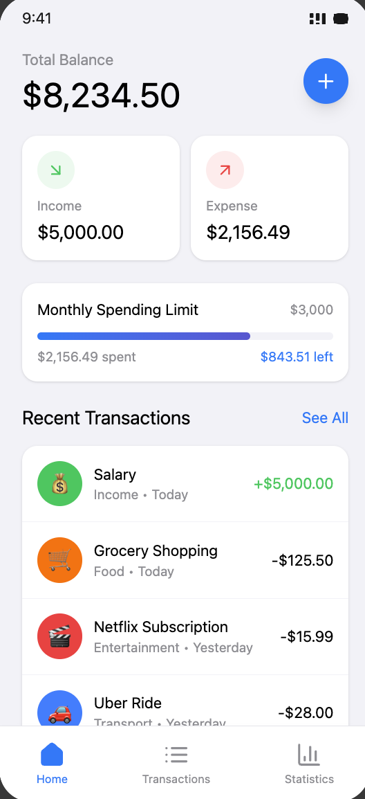
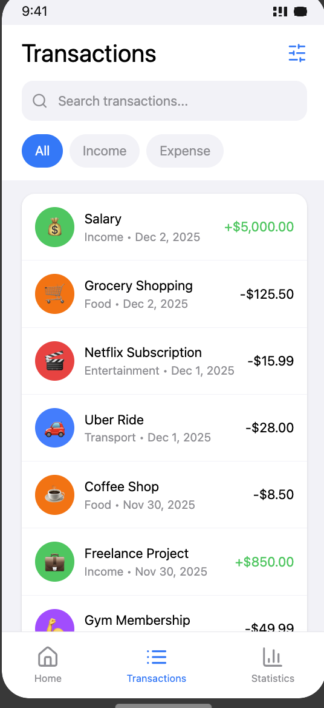
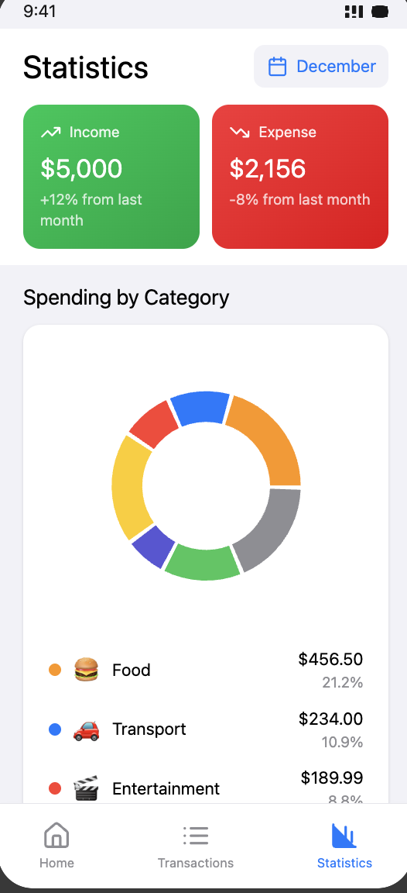

# ExpenseTracker

A comprehensive iOS expense tracking app with recurring bills, category budgets, rich Swift Charts analytics, and CSV export.

   

|  |  |  |
|---|---|---|

## Features

- **Quick expense entry** — amount, SF Symbol category picker, note, and date in a focused form
- **Recurring bills** — define bills once (rent, K-Electric, PTCL, subscriptions); a `RecurringBillEngine` materializes every due instance automatically on launch, catching up on months the app was closed
- **Category budgets** — monthly limits per category with live progress bars, near-limit and over-budget states
- **Analytics with Swift Charts** — 6-month spend bars, category donut with center total (bar fallback on iOS 16), and a 30-day daily trend line
- **CSV export** — share filtered expenses as a CSV file straight from the toolbar via `ShareLink`, built lazily by an `ExportService`
- **Search and filtering** — full-text search across notes plus a category filter with live totals
- **Offline by design** — Core Data persistence with a programmatic model; realistic PKR seed data loads on first run

## Architecture

MVVM on SwiftUI with Core Data as the single source of truth. View models observe context saves through Combine and expose plain value types to the views, so screens stay dumb and testable. The Core Data model is defined programmatically — no `.xcdatamodeld` — keeping the schema reviewable in plain Swift. Recurring-bill materialization and CSV building live in small, focused services with no UI dependencies.

```
ExpenseTracker/
├── App/            # App entry point, root tab view
├── Models/         # Core Data entities, programmatic model, category domain
├── ViewModels/     # Expense list, budgets, analytics, recurring bills
├── Views/          # SwiftUI screens + shared components
└── Services/       # RecurringBillEngine, ExportService, MockDataService
```

## Getting Started

Open `ExpenseTracker.xcodeproj` in Xcode 15+ and run. No dependencies, no configuration — all data is mocked locally.

---

Built by [Zaid Mubbasher](https://github.com/ranazaid) · [Portfolio](https://zaid-mubbashar.vercel.app) · [LinkedIn](https://www.linkedin.com/in/zaid-mubbasher-353255199)
